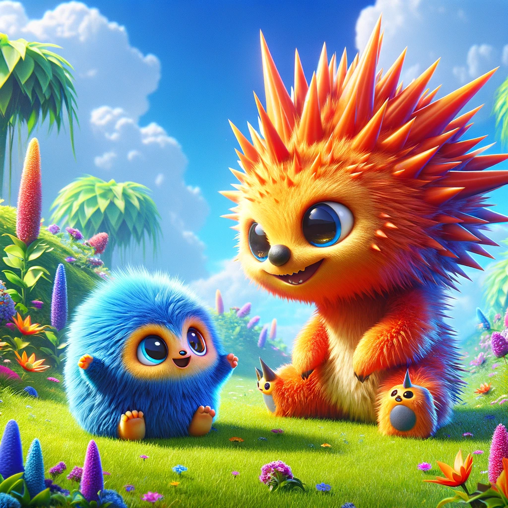

# Artificial Neuron With Backpropagation
A simple implementation of an artificial neuron with backpropagation in Python. The goal is to demonstrate the basic principles of the artificial neuron as a precursor to neural networks for learning purposes.

### Toy Problem: Classifying Fluffies and Spikeys
We train an artificial neuron to classify two types of imaginary creatures based on their height and color:

* Fluffies: These creatures are short and blue.
* Spikeys: These creatures are tall and orange.

The dataset (creatures.csv) includes features representing the height and color of each creature, along with a label indicating their species (0 for Fluffies, 1 for Spikeys).

The artificial neuron learns to classify the creatures by adjusting its weights and bias through the backpropagation algorithm, aiming to minimize the binary cross-entropy loss between its predictions and the actual species labels.

